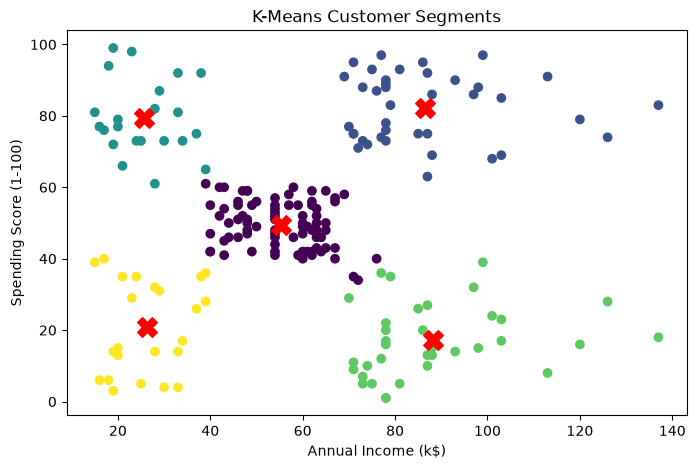

# B.Y.T.E AI internship Task 3 — K-Means Customer Segmentation
**The "Whale" Hunter**

## Project Overview
This project utilizes unsupervised machine learning to segment retail customers based on their purchasing behavior and income. It features an automated "Whale Hunter" script that mathematically identifies the most lucrative customer cluster and generates a targeted marketing brief designed to upsell that specific demographic.

**Author:** Maria Rafik Saeed

## Dataset Overview & Sample
* **Source:** `Mall_Customers.csv`
* The model utilizes two primary continuous features for spatial clustering: `Annual Income (k$)` and `Spending Score (1-100)`.

**Dataset Sample (First 10 Rows):**
| CustomerID | Gender | Age | Annual Income (k$) | Spending Score (1-100) |
|------------|--------|-----|--------------------|------------------------|
| 1          | Male   | 19  | 15                 | 39                     |
| 2          | Male   | 21  | 15                 | 81                     |
| 3          | Female | 20  | 16                 | 6                      |
| 4          | Female | 23  | 16                 | 77                     |
| 5          | Female | 31  | 17                 | 40                     |
| 6          | Female | 22  | 17                 | 76                     |
| 7          | Female | 35  | 18                 | 6                      |
| 8          | Female | 23  | 18                 | 94                     |
| 9          | Male   | 64  | 19                 | 3                      |
| 10         | Female | 30  | 19                 | 72                     |
*[cite: 13]*

## Methodology & Clustering Justification
The K-Means clustering algorithm was implemented with **$k=5$**. This specific number of clusters was chosen based on the standard Elbow Method (calculating the Within-Cluster Sum of Squares), which typically shows a distinct inflection point at 5 for this dataset, representing the optimal balance between segmentation granularity and model simplicity.

### Cluster Centroids
The algorithm converged on the following five central points for each customer segment[cite: 14]:
* **Cluster 0:** 55.30k Income | 49.52 Spending Score[cite: 14]
* **Cluster 1:** 86.54k Income | 82.13 Spending Score *(Highest Spending)*[cite: 14]
* **Cluster 2:** 25.73k Income | 79.36 Spending Score[cite: 14]
* **Cluster 3:** 88.20k Income | 17.11 Spending Score[cite: 14]
* **Cluster 4:** 26.30k Income | 20.91 Spending Score[cite: 14]

## Cluster Visualization

*The scatter plot visualizes the 5 distinct customer groups, with the red 'X' markers indicating the exact mathematical centroid of each cluster[cite: 15].*

## Business Profiles & Actionable Recommendations

### 1. The "Whales" (Cluster 1) — High Income, High Spending
* **Profile:** Premium, highly engaged customers who drive the majority of high-margin revenue.
* **Recommendations:** 
  * Trigger the "Whale Hunter" brief: launch exclusive early-access product lines and VIP concierge services.
  * Avoid heavy discounting, which may devalue the brand; focus on experiential rewards.

### 2. Standard Customers (Cluster 0) — Average Income, Average Spending
* **Profile:** The baseline demographic. Consistent, reliable, but not prone to extreme splurging.
* **Recommendations:**
  * Implement standard loyalty programs (e.g., points-per-purchase) to gradually increase their spending frequency.
  * Target with seasonal promotions and bundled deals.

### 3. Impulse Spenders (Cluster 2) — Low Income, High Spending
* **Profile:** Trend-focused customers willing to stretch their budget for desirable items.
* **Recommendations:**
  * Utilize scarcity marketing (e.g., "Flash Sales", "Limited Time Offers").
  * Promote entry-level luxury items or flexible payment options (Buy Now, Pay Later).

### 4. Careful Spenders (Cluster 3) — High Income, Low Spending
* **Profile:** Customers with high purchasing power but strict purchasing criteria. They look for value and durability.
* **Recommendations:**
  * Shift marketing messaging away from trends and toward ROI, quality, and long-term durability.
  * Offer risk-free trials or extended warranties to overcome purchasing hesitation.

### 5. Budget Conscious (Cluster 4) — Low Income, Low Spending
* **Profile:** Price-sensitive shoppers who likely only purchase out of necessity or during major sales.
* **Recommendations:**
  * Target primarily during heavy clearance events to liquidate aging inventory.
  * Minimize active ad-spend on this group to lower Customer Acquisition Cost (CAC).

## Artifacts & Deliverables Included
* `seg.py`: The clustering training script and CLI prediction loop.
* `cluster_centroids.csv`: The exported coordinates of the 5 cluster centers.
* `dataset_sample.csv`: A sanitized sample of the input data used for training.
* `image_b1d8c6.png`: The matplotlib scatter plot visualization.
* `index.html`: The PyScript Vercel web wrapper containing the interactive segmentation predictor.

## Reproduction Instructions
1. Clone this repository and ensure `Mall_Customers.csv` and `seg.py` are in the same directory.
2. Run `python seg.py` in your terminal to see the automated Whale Hunter trigger and start the manual terminal predictor.
3. To view the web simulator, host the directory on Vercel or open `index.html` via a local live server.
